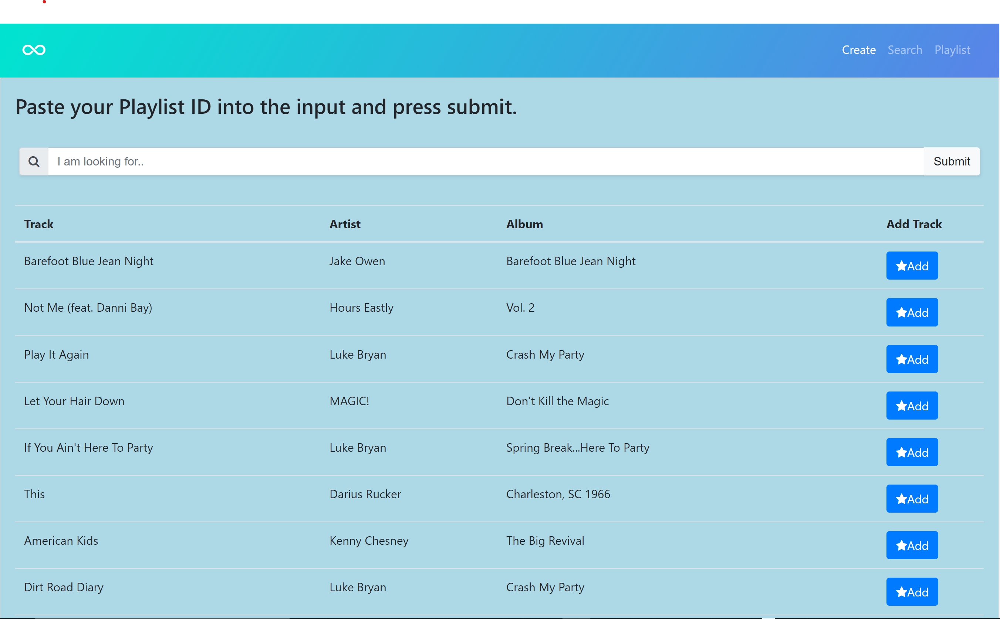

# Project-2-

## URL
https://ancient-cove-67868.herokuapp.com/

## Welcome to QUARAN-TUNEZ

## Modules
- MySQL
- Handlebars
- Express
- NodeJS
- JQuery

## Description

We wanted to build an app that could be beneficial for people stuck at home during the quarantine and even when its lifted and we can make our ways back out into the new world.
The object was to create a space where users can come to listen to pre generated Spotify playlists depending on their mood or create playlists and merge them with their own personal Spotify account. 

## Usage

The user is to sign in to their Soundcloud account, and the application stores the user ID. The user is prompted to name their playlist, with an optional description, and whether or not they want the playlist to be private or note. Using this information, a blank playlist is generated. The user can search for songs by title, and click buttons to add to their existing playlist. The aformentioned parameters are stored in MySQL database. The pages are generated through Handlebars.

## Screenshots

